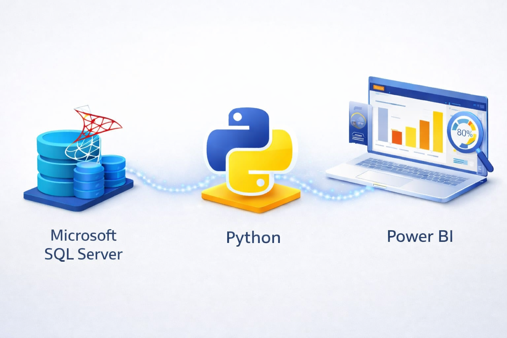
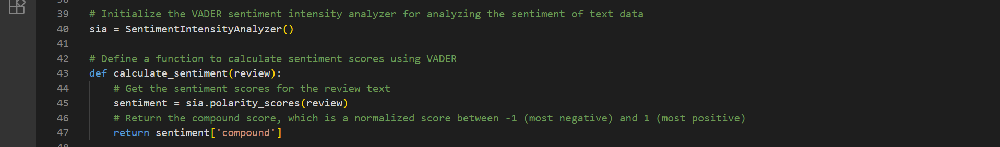
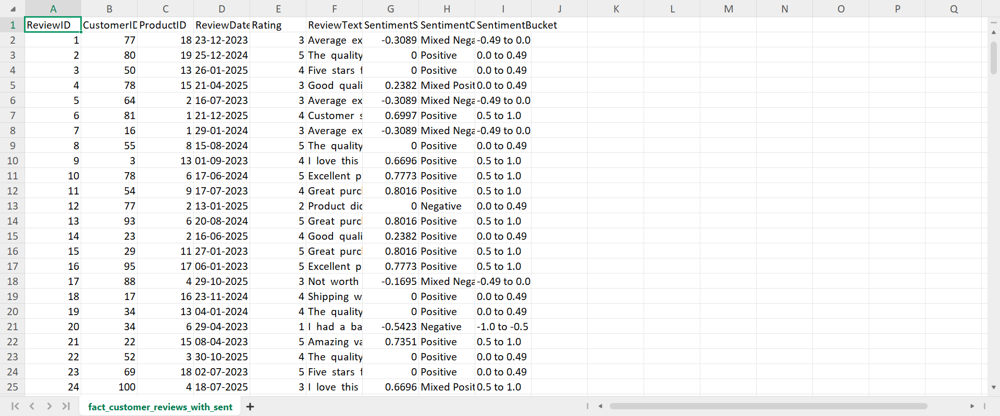
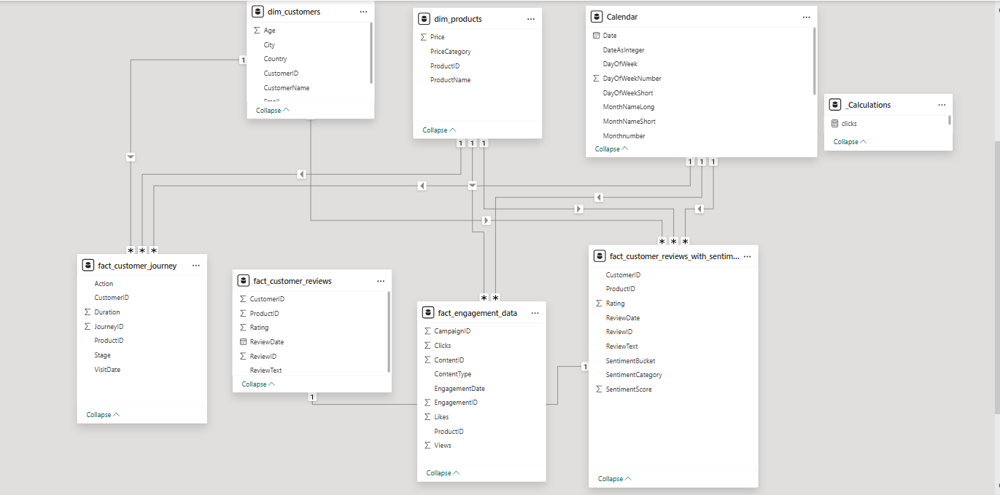
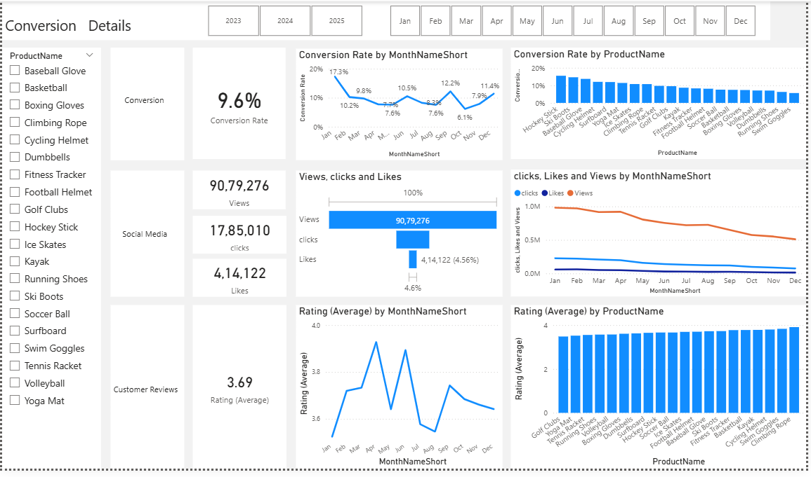
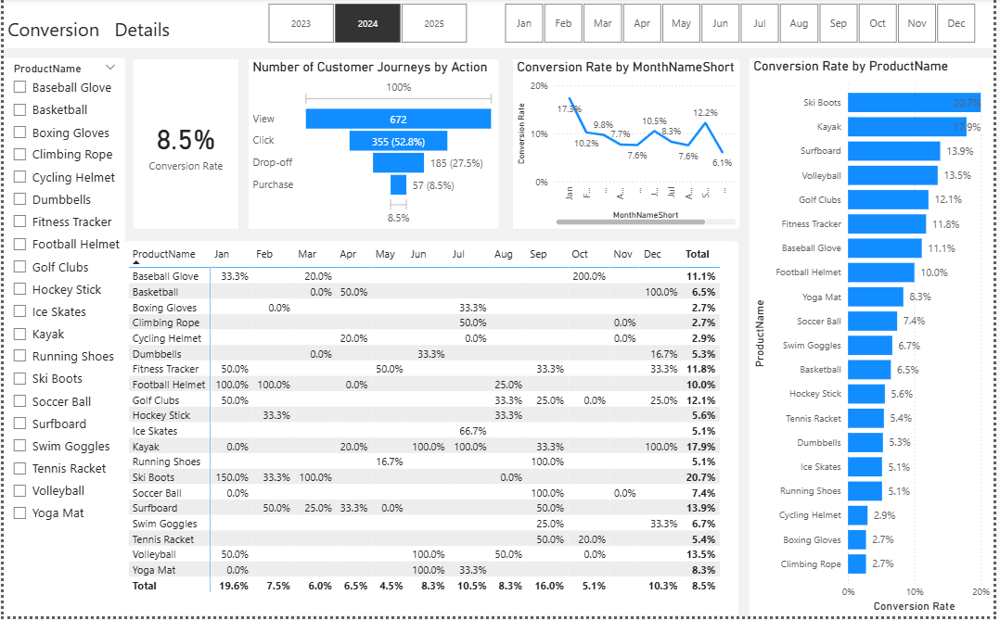
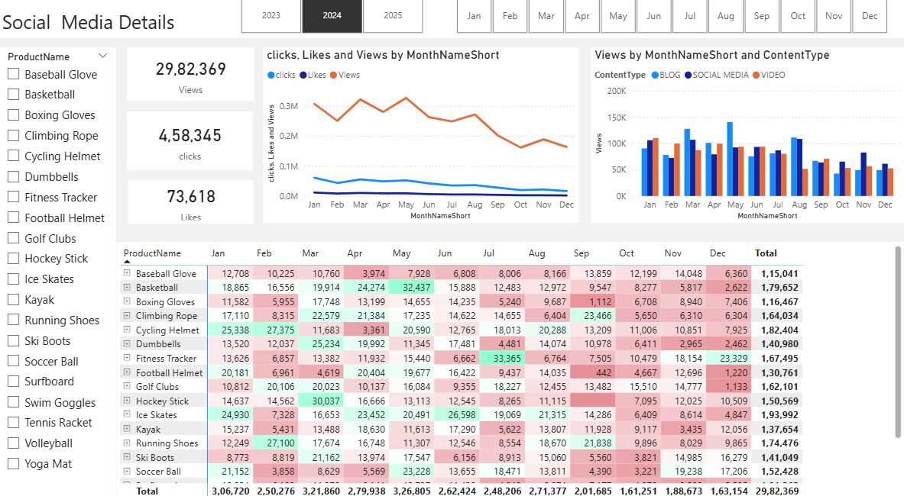
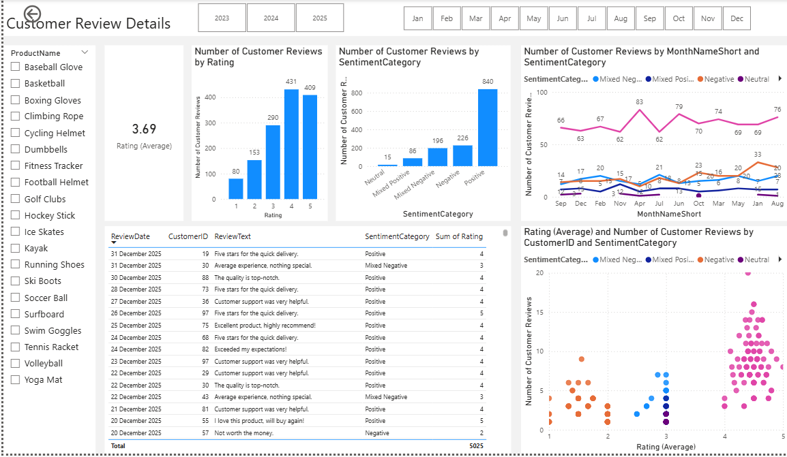

# 🟢📊💹⚡🌱 Marketing Analytics

*Analyzing marketing performance, customer engagement, conversion trends, and customer feedback*

---

## Table of Contents
- 🏗️ [Architecture](#architecture)
- 📌 [Business Problem Statement](#business-problem-statement)
- 🗂️ [Project Overview](#project-overview)
- 🛠️ [Tools & Technologies](#tools--technologies)
- 🧱 [Project Structure](#project-structure)
- 🔄 [Project Workflow](#project-workflow)
- 💾 [SQL Data Acquisition & Analysis](#sql-data-acquisition--analysis)
- 🐍 [Python Sentiment Analysis](#python-sentiment-analysis)
- 🧩 [Data Modeling Diagram](#data-modeling-diagram)
- 📊 [Power BI Dashboards](#power-bi-dashboards)
- 📁 [PPT / Reports](#ppt--reports)
- 🔍 [Key Insights](#key-insights)
- 💡 [Business Recommendations](#business-recommendations)
- 💼 [Business Value](#business-value)
- ✅ [Conclusion](#conclusion)

---

## Architecture
*Illustrates how SQL, Python, CSV, and Power BI are connected for end-to-end marketing analytics.*  

---

## Business Problem Statement

**Online Retail Business Problem:**  
Online retail business is facing reduced customer engagement and conversion rates despite launching several new online marketing campaigns. They are reaching out to you to help conduct a detailed analysis and identify areas for improvement in their marketing strategies.  

**Key Points:**  
- **📉 Reduced Customer Engagement:** Number of interactions with the site and marketing content has declined.  
- **🔻 Decreased Conversion Rates:** Fewer site visitors are converting into paying customers.  
- **💰 High Marketing Expenses:** Significant investments in marketing campaigns are not yielding expected returns.  
- **🗣️ Need for Customer Feedback Analysis:** Understanding customer opinions about products and services is crucial.  

---

## Project Overview

- 🎯 Analyze digital marketing performance for an online retail business  
- 👥 Examine customer engagement, conversion behavior, and feedback trends  
- 📉 Identify gaps in marketing effectiveness despite high marketing spend  
- 📊 Support data-driven decision-making to improve marketing ROI  

---

## Tools & Technologies
- 🐍 **Python** – Data extraction, cleaning, enrichment & export to Power BI  
- 📊 **Pandas** – Data manipulation & transformation  
- 🧠 **NLTK (VADER)** – Sentiment analysis  
- 🔌 **pyodbc** – SQL Server connection  
- 🗄️ **SQL Server** – Data storage  
- 💻 **VS Code** – Python IDE  
- 📁 **CSV Files** – Optional processed export  
- 📊 **Power BI** – Dashboards & visualizations  

---

## Project Structure
Marketing-Analytics/  
│  
├── sql/  
│   ├── marketing_backup.bak  
│   └── marketing_analysis_queries.sql  
├── python/  
│   ├── data_cleaning.py  
│   └── sentiment_analysis.py  
├── data/  
│   └── processed_data.csv  
├── power_bi/  
│   └── marketing_analytics_dashboard.pbix  
├── dashboard1.png  
├── dashboard2.png  
├── dashboard3.png  
├── dashboard4.png  
├── data_model.png  
├── reports/  
│   └── marketing_report.pptx  
└── README.md  

---

## Project Workflow
🟢 Start: SQL Backup (.bak file)  
        │  
        ▼  
📂 Restore Database & Prepare Tables  
        │  
        ▼  
📝 SQL Tables & Queries  
        │  
        ▼  
🐍 Python Scripts  
  - Cleaning & Enrichment  
  - Sentiment Analysis  
        │  
        ▼  
📄 Export Processed CSV (Used for Data Modeling in Power BI)  
        │  
        ▼  
📊 Connect to Power BI  
  - SQL Queries  
  - Processed CSV (for relationships & visuals)  
        │  
        ▼  
🧮 Build Dashboard & KPIs  
  - One-to-many relationships  
  - Calculated Measures  
        │  
        ▼  
🎯 End: Interactive Dashboard & Insights  

---

## SQL Data Acquisition & Analysis

### 1. Customer & Geography Data Join
*Enriches customer data with geographic information using JOINs.*  

### 2. Product Categorization
*Categorizes products into Low, Medium, and High price ranges using CASE statements.*  

### 3. Customer Journey Cleaning
*Uses CTEs and ROW_NUMBER() to identify and remove duplicate records in customer journey data.*  

---

## Python Sentiment Analysis

### 1. Sentiment Calculation Logic
*This section shows the Python code for calculating sentiment scores using NLTK VADER.*  
*Scores range from -1 (most negative) to 1 (most positive).*  

### 2. Sentiment Categorization & Bucketing
*Categorizes reviews based on sentiment scores and rating.*  
*Categories include Positive, Mixed Positive, Neutral, Mixed Negative, and Negative.*  
*Scores are also grouped into buckets for business insights.*  

### 3. CSV Output Preview
*After analysis, the enriched dataset is exported to CSV.*  
*Columns include ReviewID, CustomerID, ProductID, ReviewDate, Rating, ReviewText, SentimentScore, SentimentCategory, and SentimentBucket.*  

---

## Data Modeling Diagram
*Shows relationships between tables, CSV inputs, and Power BI data model for dashboard calculations.*  

---

## Power BI Dashboards

### 1. Overview

📌 **Purpose:** Analyze digital marketing performance for an online retail business  
👥 **Focus:** Customer engagement, conversion behavior, and feedback trends  
🎯 **Goal:** Identify gaps in marketing effectiveness & optimize ROI  
📊 **Outcome:** Data-driven insights for better business decisions  

**Dashboard Insights:**  
- 📊 **Conversion Rate:** Currently standing at 9.6%, providing a baseline for marketing effectiveness.  
- 📈 **Engagement Volume:** Tracking over 9 million views and 1.7 million clicks across all product categories.  
- ⭐ **Customer Sentiment:** An average rating of 3.69, indicating generally positive feedback with room for service optimization.

### 2. Conversion Details

📌 **Purpose:** Understand product and campaign performance across the funnel  
👥 **Focus:** Conversion rates by product, category, and seasonal trends  
🎯 **Goal:** Identify drop-offs and optimize the purchase journey  
📊 **Outcome:** Recommendations for improving overall conversions  

**Dashboard Insights:**  
- 🔁 **Conversion Funnel:** Analysis of the customer journey shows 672 views resulting in 355 clicks and 57 final purchases (8.5% conversion rate for the selected period).  
- 📅 **Seasonal Trends:** Conversion rates peak significantly in January (17.3%) and December (12.2%).  
- 🛒 **Top Products:** Ski Boots and Kayaks lead, while Climbing Rope shows the lowest conversion efficiency.

### 3. Social Media Details

📌 **Purpose:** Track campaign performance and engagement trends  
👥 **Focus:** Channel-level engagement and content-type effectiveness  
🎯 **Goal:** Optimize marketing strategy for maximum reach  
📊 **Outcome:** Identify high-performing content and peak engagement periods  

**Dashboard Insights:**  
- 📣 **Channel Performance:** Views (2.9M), Clicks (458K), Likes (73K) to measure brand awareness.  
- 🎥 **Content Strategy:** Videos consistently drive higher engagement than blogs or social media posts.  
- 📆 **Monthly Reach:** Engagement peaks in April and July, highlighting high-performing campaigns.

### 4. Customer Review Details

📌 **Purpose:** Understand customer satisfaction and feedback trends  
👥 **Focus:** Sentiment, ratings, and recurring complaints  
🎯 **Goal:** Improve products and services based on customer insights  
📊 **Outcome:** Implement actionable changes to enhance customer experience  

**Dashboard Insights:**  
- 🧠 **Sentiment Analysis:** Categorized reviews into Positive, Mixed, and Negative sentiments using Python's NLTK (VADER).  
- 🌟 **Rating Distribution:** Majority 4-5 star reviews, but notable "Mixed Negative" cluster in some products.  
- 📝 **Feedback Trends:** Sentiment most positive in December, likely due to successful year-end service initiatives.

---

## PPT / Reports
[Download Detailed PPT Report](reports/marketing_report.pptx)

---

## Key Insights
- 📅 Conversion rates peak seasonally  
- 🔝 Top-performing products identified  
- 📉 Engagement trends across campaigns  
- 🗣️ Customer sentiment impacts sales  

---

## Business Recommendations
- 🎯 Focus on high-performing products & peak seasons  
- 🧪 Optimize underperforming campaigns with targeted strategies  
- ✍️ Align content to boost engagement  
- 🛠️ Address recurring feedback issues  

---

## Business Value
- 📊 Clear visibility into marketing performance  
- 👥 Personalized marketing strategies via customer insights  
- 💰 Optimize budget allocation for higher ROI  
- 🔁 Drive continuous campaign improvements  
- 😊 Enhance brand reputation & customer satisfaction  

---

## Conclusion
- 🧭 End-to-end marketing analytics pipeline implemented  
- 🔍 SQL, Python & Power BI integrated for insights  
- 🚀 Dashboard empowers quick, actionable business decisions  
- 📈 Data-driven strategy improves conversions, engagement & ROI
